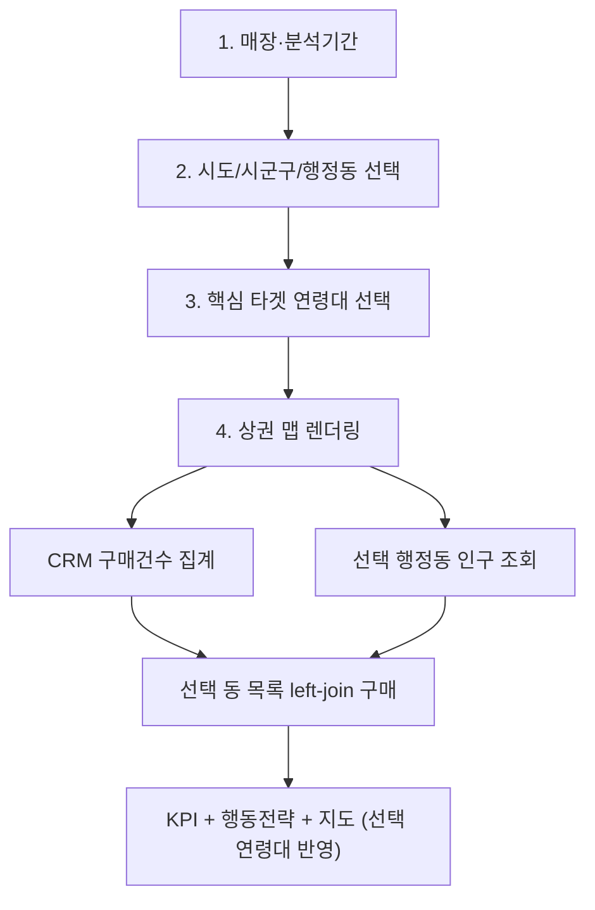

# 매장 → 핵심상권(시·군·동) → 핵심타겟(연령) → 렌더링 4단계 UI

마스터 플랜([동_단위_상권_퍼포먼스_맵_f6de3504.plan.md](c:\Users\billy\.cursor\plans\동_단위_상권_퍼포먼스_맵_f6de3504.plan.md))에 **Phase 17**으로 추가한다.

## 확정 방식

- **렌더링 전**에 GeoJSON(`build_geojson_index`) 기준으로 **시도 → 시군구 → 행정동** 계층 멀티셀렉트
- **렌더링 전**에 핵심 타겟 연령대(10대~70대이상) 멀티셀렉트도 함께 선정 (기본 30·40·50대)
- 선택한 행정동만 KPI·지도·표 대상
- 선택했지만 기간 내 구매가 없는 동은 `purchase_count=0`으로 left-join 포함 (침투율 0, 밀집도는 인구로 계산) — 핵심상권 “잠재” 분석 가능
- 기존 렌더 **후** 시군구 필터·연령 필터는 렌더 **전** 단계로 이전

## UI 구조 ([dong_commercial_map.py](dong_commercial_map.py) `render_dong_commercial_map`)

### 1단계 — 매장 선정
- 기존 매장 multiselect + 분석기간 유지
- 매장 0개면 이후 단계 비활성/안내

### 2단계 — 핵심상권(시·군·동)
GeoJSON 인덱스(`sidonm`, `sggnm`, `adm_nm`, `adm_cd2`)로 캐스케이딩:

| 위젯 | 동작 |
|---|---|
| 시도 | multiselect. 옵션 = GeoJSON 고유 `sidonm` |
| 시군구 | 선택 시도에 속한 `sggnm`만 |
| 행정동 | 선택 시군구에 속한 동만. 라벨은 `adm_nm`(또는 동명만), 값은 `adm_cd2` |

보조:
- 「현재 시군구 행정동 전체 선택」 버튼(또는 multiselect default를 해당 시군구 전체로)
- 행정동 0개면 「상권 맵 렌더링」 비활성 + 경고
- 선택 변경 시 `dcm_raw_cache_key`와 무관하게 결과 재계산 가능하도록, 캐시 키에 **선택된 `adm_cd2` 집합** 포함

### 3단계 — 핵심 타겟 연령대
- 옵션: `["10대","20대","30대","40대","50대","60대","70대 이상"]` (Phase 16 `AGE_BUCKET_LABELS` 재사용)
- 기본값: `["30대","40대","50대"]` = `DEFAULT_TARGET_AGE_KEYS`
- 0개 선택 시 「상권 맵 렌더링」 비활성 + 경고
- 렌더 후 재선택 시 인구 API 재조회 없이 즉시 `target_density`·A/B/C/D 재계산 (session_state 재사용)
- 캐시 키에 **선택된 연령 키 집합**도 포함해 이후 캐싱 계층과 충돌 방지

### 4단계 — 상권 맵 렌더링
- 매장·기간·행정동 코드·연령 키가 모두 있을 때만 primary 버튼 활성
- 클릭 시: CRM 집계 → 선택 동 프레임과 left-join → 인구 bulk → KPI(연령 반영)

## 데이터 파이프라인 변경

렌더 직후 로직을 다음으로 교체:

1. `aggregate_purchase_count_by_dong(...)` (기존)
2. **선택 행정동 스켈레톤** DataFrame 생성  
   `[admin_dong_code=adm_cd2, admin_dong_name=동명, purchase_count=0]` + `_attach_sigungu`
3. CRM 결과와 `admin_dong_code` 기준 left-join(또는 outer 후 선택 코드만 필터) → 구매 없는 동은 0 유지
4. `fetch_population_bulk(client, selected_codes, yyyymm)` — **선택 코드만** 조회(불필요 API 절감)
5. `compute_dong_kpi(crm, pop, selected_age_keys)` / `assign_quadrant` / 지도·표 (선택 연령대 반영)

중앙값·A/B/C/D는 **선택된 핵심상권 × 선택 연령대** 기준으로 계산된다.

## 마스터 플랜 반영

- overview에 “매장 → 시·군·동 핵심상권 → 연령대 → 렌더링” 워크플로 명시
- todo `phase17-trade-area-select-flow` 추가
- 짧은 절: 렌더 전 GeoJSON 계층 선택, 렌더 전 연령대 선정, 구매 0동 포함

## 검증

1. 매장만 고르고 동 미선택 → 렌더 버튼 비활성/경고
2. 동은 골랐지만 연령 0개 → 렌더 버튼 비활성/경고
3. 울산 중구 일부 동만 선택 → 지도·표에 해당 동만
4. 구매 없는 선택 동 → 침투율 0, 밀집도(인구)는 표시
5. 시도/시군구 변경 시 하위 선택지가 맞게 축소
6. 연령대 변경은 인구 API 재조회 없이 즉시 밀집도·그룹 재계산
