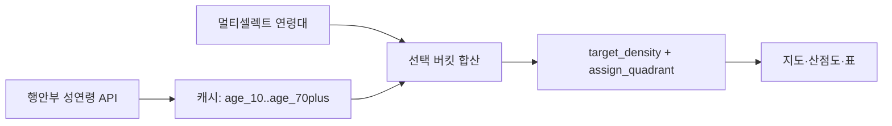

# 핵심 타겟 연령대 선택 메뉴 — 구현 플랜

기존 마스터 플랜([동_단위_상권_퍼포먼스_맵_f6de3504.plan.md](c:\Users\billy\.cursor\plans\동_단위_상권_퍼포먼스_맵_f6de3504.plan.md))의 **Phase 16**으로 추가한다. 구현 확정 방식은 **복수 선택 + 선택 버킷 합산**이다 (기본값: 30대·40대·50대 = 현재 동작과 동일).

## 왜 이 방식인가

행안부 `admmSexdAgePpltn` 응답은 이미 10세 단위 전 버킷을 준다 (`male{X}AgeNmprCnt` / `feml{X}AgeNmprCnt`, X=0,10,…,100). 지금은 [dong_commercial_map.py](dong_commercial_map.py)에서 `target_buckets = ("30","40","50")`만 합산해 `age_30_49_population` 한 숫자로 캐시한다.

연령 메뉴를 바꾸며 API를 다시 치지 않으려면, **조회 시 전 버킷을 캐시에 저장**하고 UI 선택만 바꿔 합산·KPI·4분면을 재계산해야 한다.



## 연령대 ↔ API 버킷 매핑

| UI 라벨 | API 버킷(남+여 합) |
|---|---|
| 10대 | 10 (만 10~19) |
| 20대 | 20 |
| 30대 | 30 |
| 40대 | 40 |
| 50대 | 50 |
| 60대 | 60 |
| 70대 이상 | 70 + 80 + 90 + 100 |

0세(0~9)는 메뉴에 두지 않는다.

## 변경 범위

### 1. UI — [dong_commercial_map.py](dong_commercial_map.py) `render_dong_commercial_map`

매장·분석기간 옆에 `st.multiselect`:

- 옵션: `["10대","20대","30대","40대","50대","60대","70대 이상"]`
- 기본값: `["30대","40대","50대"]`
- 0개 선택 시 경고 후 렌더 중단
- 선택 변경만으로도 밀집도·그룹이 바뀌도록, 시군구 필터와 같이 **원본 인구(버킷별)를 session_state에 보관**하고 재합산 (인구 API 재호출 없음)

### 2. 연령 파싱 — `fetch_admin_dong_age_population`

고정 `("30","40","50")` 합산 대신, 버킷별 dict를 반환:

```python
# 예
{
  "ok": True,
  "age_buckets": {"10": n, "20": n, ..., "60": n, "70plus": n},
  "total_population": ...,
}
```

`70plus` = 70+80+90+100 남녀 합.

### 3. 캐시 스키마 — `app_dong_population_cache`

기존 `age_30_49_population`만으로는 선택 UI를 지탱할 수 없음. 마이그레이션 SQL 추가:

- `age_10_population` … `age_60_population`, `age_70plus_population` INTEGER
- `age_30_49_population`은 하위호환용으로 유지하되, 저장 시 **현재 선택과 무관하게** “선택된 기본 타겟(30+40+50) 합” 또는 deprecate 후 UI/KPI는 새 컬럼만 사용
- 기존에 합산값만 있는 행은 **무효**이므로, 배포 시 해당 `yyyymm` 캐시 삭제 또는 upsert로 전 버킷 재적재 (테이블이 아직 미생성인 환경은 CREATE만으로 충분)

파일: `SUPABASE_APP_DONG_POPULATION_CACHE_AGE_BUCKETS.sql` (신규)

### 4. KPI — `compute_dong_kpi` / 렌더 파이프라인

- 인구 DataFrame에 `target_population`(선택 버킷 합) 컬럼을 두고  
  `target_density = target_population / total_population * 100`
- `assign_quadrant`는 변경 없음 (밀집도 값이 바뀌면 중앙값·그룹이 자연히 재편성)
- 표/호버/산점도 라벨: `핵심인구(선택: 30·40·50대)`처럼 **현재 선택 반영**

### 5. 플랜 문서 반영

마스터 플랜에 아래를 추가·수정:

- §2.2 / §3: “고정 3040” → “UI 선택 연령대 합산”
- todos에 `phase16-target-age-multiselect` 추가
- overview에 “핵심 타겟 연령 선택 가능” 한 줄 명시

## 구현 시 주의

- **침투율은 연령과 무관** (구매건수/세대수). 연령 선택은 밀집도·4분면·버블 크기만 바꿈.
- Streamlit `@st.cache_data`로 묶인 age fetch 함수 시그니처/반환 변경 시 캐시 자동 무효화됨.
- 시군구 필터와 연령 필터는 독립: 인구 버킷 원본 → 연령 합산 → 시군구 필터 → KPI/지도 순으로 유지하면 재조회 없이 둘 다 즉시 반응.

## 검증 기준

1. 기본(30·40·50) 선택 시 기존 밀집도와 동일(허용 오차 반올림)
2. 40대만 선택 → 밀집도·그룹 분포가 바뀌고, 네트워크에 행안부 age API 추가 호출 없음(캐시 적중 시)
3. 70대 이상만 선택 → `70+80+90+100` 합이 반영
4. 표 컬럼/차트 축 라벨에 선택 연령대가 표시됨
