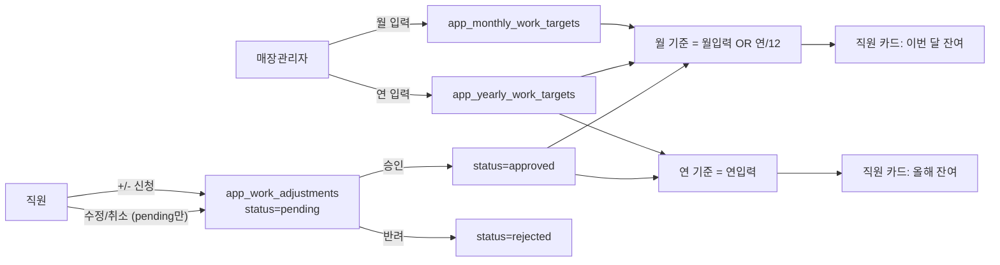

# 근태관리 (ERP 근태 관리 모듈)

> 본 문서는 `emons-web-sales` (Streamlit + Supabase) 의 **ERP 근태 관리 모듈** 명세서입니다.
> 다른 환경(맥/PC)에서 이 저장소를 처음 받았을 때 모듈 구조·테이블·SQL 마이그레이션·최근 변경 이력을 한 번에 파악하기 위한 단일 진입 문서입니다.

---

## 1. 개요

- **모듈 이름**: ERP 근태 관리 (`render_erp_attendance`)
- **한 줄 설명**: 매장 단위로 사전 근무 일정 → 실제 출퇴근 기록 → 시차/추가근무·연차 → 월말 요약까지 통합 관리. 매장 공용 일정·요일별 최소 인원 규칙도 함께 처리.
- **엔트리**: [`app.py`](app.py) `render_erp_attendance()` (L9475)
- **메뉴 위치**: 사이드바 ERP 섹션의 `🗓️ 근태 관리`
- **권한 분기** (`render_erp_attendance` 내부)
  - `superadmin` → `_erp_render_superadmin_view(today)` 단독 화면
  - `store_admin` → 7개 탭 (근무 일정 / 최소 인원 / 캘린더 / 휴무·근태 입력 / 추가근무·시차 관리 / 연차·월차 / 월말 요약)
  - 일반 `user` → 5개 탭 (근무 일정 / 캘린더 / 휴무·근태 입력 / 추가근무·시차 신청 / 내 연차 현황)
- **매장 분리 키**: `db_filename` (출근 매장) / `home_db_filename` (소속 매장) — 다점포 지원

---

## 2. 데이터 모델

총 8개 테이블 + 1개 확장 컬럼. 모든 DDL은 `IF NOT EXISTS` 가드로 멱등 실행 가능.

### 2-1. 기본 5종 — [`SUPABASE_APP_ERP_ATTENDANCE.sql`](SUPABASE_APP_ERP_ATTENDANCE.sql)

| 테이블 | 용도 | 핵심 컬럼 |
|---|---|---|
| `app_staffing_rules` | 요일별 시간대 최소 근무 인원 규칙 | `db_filename`, `day_of_week(0~6)`, `slot_start`, `slot_end`, `min_staff` |
| `app_shift_schedules` | 사전 근무 일정 계획 | `db_filename`, `employee_name`, `shift_date`, `shift_start`, `shift_end`, `work_location_name`, `note` |
| `app_leave_grants` | 직원별 연차 부여 + 입사일 | `home_db_filename`, `employee_name`, `hire_date`, `year`, `annual_days` (UNIQUE `home_db_filename`+`employee_name`+`year`) |
| `app_attendance_logs` | 실제 근태 기록 (다점포) | `home_db_filename`, `work_db_filename`, `employee_name`, `log_date`, `work_type`, `leave_deduction`, `diff_minutes`, `start_time`, `end_time` |
| `app_store_hours` | 매장별 기본 근무시간 (주중/주말·공휴일) | `db_filename` UNIQUE, `weekday_start/end`, `weekend_start/end` (학성/삼산/양산 seed 포함) |
| `app_overtime_requests` | 추가근무 신청·승인 | `home_db_filename`, `employee_name`, `request_date`, `extra_start`, `extra_end`, `extra_minutes`, `status('pending'/'approved'/'rejected')` |

전 테이블 RLS 활성화 + 전체 허용 정책 (`USING (true) WITH CHECK (true)`).

### 2-2. 카운터 확장 — [`SUPABASE_APP_ATTENDANCE_COUNTER.sql`](SUPABASE_APP_ATTENDANCE_COUNTER.sql)

| 테이블 / 컬럼 | 용도 | 비고 |
|---|---|---|
| `app_store_events` | 매장 공용 일정 (회의·점검·이벤트 등 메모용) | `event_date` (시작일), `end_date` (다일정 시), `title`, `start_time`, `end_time`, `note` — 개인 근무시간 계산에는 영향 없음 |
| `app_employee_settings.monthly_target_hours` | 직원 월 목표 근무시간 | 기존 테이블에 `ADD COLUMN IF NOT EXISTS` |
| `app_overtime_claims` | 추가근무 보상 신청 | `compensation_type('comp_time'/'leave_swap'/'payment')`, `status('pending'/'approved'/'rejected')` |

---

## 3. 엔트리 & 화면 구성

### 3-1. 권한별 탭 매핑

| 탭 | 함수 | 시작 라인 | store_admin | user |
|---|---|---|:-:|:-:|
| 근무 일정 계획 | `_erp_tab_shift_plan` | L9537 | ✓ | ✓ |
| 최소 인원 설정 + 매장 공용 일정 | `_erp_tab_staffing_rules` | L9899 | ✓ | — |
| 월별 캘린더 | `_erp_tab_calendar` | L10397 | ✓ | ✓ |
| 휴무·근태 입력 | `_erp_tab_attendance_input` | L10789 | ✓ | ✓ |
| 추가근무·시차 | `_erp_tab_comptime_overtime` | L10971 | ✓ | ✓ |
| 연차/월차 관리 | `_erp_tab_leave_grants` | L11342 | ✓ | — |
| 월말 요약 | `_erp_tab_monthly_summary` | L11536 | ✓ | — |
| 내 연차 현황 | `_erp_tab_my_leave_status` | L11601 | — | ✓ |
| 관리자(전사) 뷰 | `_erp_render_superadmin_view` | L11633 | — | — (superadmin 전용) |

### 3-2. 라우팅 분기 (L9491~9532 요약)

```
role == "superadmin"  → _erp_render_superadmin_view(today) 후 return
role == "store_admin" → 7개 탭
else                  → 5개 탭
```

---

## 4. 주요 기능 상세

### 4-1. 매장 공용 일정 (`_erp_tab_staffing_rules` 후반부, L10135~10306)

- **등록**: 폼 밖 라디오(`기간 유형: 하루/여러 날`, `시간 유형: 종일/시간대 지정`) → 폼 내부 입력. `_erp_insert_row("app_store_events", ...)`
- **수정 (인라인)**: 행의 `✏️` 버튼 → `st.session_state["se_editing_id"]` 설정 → 동일 위치에 `st.container(border=True)`로 수정 폼 펼침. 저장 시 `_erp_update_row(...)`, 취소 시 session_state pop. (커밋 `c073d17`, 2026-05-28)
- **삭제**: `🗑️` 버튼 → `_erp_delete_row(...)`. 편집 중인 동일 ID였다면 편집 상태도 함께 정리.
- **다일정 표시**: `end_date` 가 있으면 `event_date ~ end_date` 사이 모든 날짜 캘린더에 배지. 월 경계에 걸치는 일정은 `_erp_store_events_cached` (L9173) 가 클라이언트 단에서 필터.
- **구 스키마 호환**: `end_date` 컬럼 누락 환경에서는 `PGRST204` / `"end_date"` / `"schema cache"` 감지 시 컬럼 제외 후 자동 재시도.

### 4-2. 월 목표 vs 누적·잔여 카운터

- `app_employee_settings.monthly_target_hours` 가 직원별 월 목표 (NUMERIC, NULL 허용 → 매장 기본값 적용)
- `_erp_get_employee_monthly_target` (L9156) — 직원 우선, 없으면 매장 기본
- `_erp_compute_worked_minutes` (L9231) — 월 누적 실근무 분
- `_erp_compute_monthly_remaining` (L9264) — 잔여(목표−누적) 분

### 4-3. 추가근무 보상 신청 (`app_overtime_claims`)

- 보상 유형 3가지: `comp_time` (시차 적립) / `leave_swap` (연차 대체) / `payment` (급여 청구)
- 흐름: 직원 신청 → `status='pending'` → 관리자 승인/반려 → `status` + `approved_by/at` 갱신
- 캐시: `_erp_overtime_claims_cached` (L9213, TTL 60초, status 필터 가능)
- 잔여 시차: `_erp_compute_remaining_comptime` (L9347)

### 4-4. 캘린더 빠른 수정/삭제

- 월별 캘린더 셀에서 특정 날짜 1건만 빠르게 수정/삭제 (커밋 `60202e9`)
- 일정 기본 표시 기간이 1개월로 확장

### 4-5. 표시명 자동 변환

- 이메일로 저장된 직원명을 캘린더·근태 화면에서 `app_users.name` 표시명으로 자동 치환 (커밋 `9b037ad`, `46cd734`)
- `_get_current_user_display_name()` 헬퍼로 일관된 표시

### 4-6. 휴일·근무시간 헬퍼

- `_erp_is_weekend_or_holiday(d)` (L9002) — 한국 공휴일 포함 주말 판정
- `_erp_default_times_for_date(db_filename, d)` (L9030) — 매장 기본 근무시간 반환
- `_erp_minutes_between(t_start, t_end)` (L9038) — 자정 횡단 시간 계산
- `_erp_compute_monthly_accrued(hire_date, as_of)` (L9378) — 입사일 기반 월 누적 연차

---

## 5. 공용 헬퍼

### 5-1. CRUD (L9441~9472)

```python
_erp_insert_row(table, row)            # (ok, err) 반환
_erp_update_row(table, row_id, patch)  # id eq 조건
_erp_delete_row(table, row_id)         # id eq 조건
```

모든 매장 공용 일정·시차·연차·근태 화면이 이 3개 함수만 사용 — Supabase 클라이언트 호출이 한 곳에 모임.

### 5-2. 캐시 (Streamlit `@st.cache_data`)

| 함수 | TTL | 키 | 클리어 시점 |
|---|---|---|---|
| `_erp_staffing_rules_cached` (L9104) | 120s | `db_filename` | 규칙 추가/삭제 후 |
| `_erp_store_hours_cached` (L9117) | 120s | `db_filename` | 매장 기본 시간 변경 후 |
| `_erp_employee_settings_cached` (L9130) | 120s | `db_filename` | 직원 설정 변경 후 |
| `_erp_store_events_cached` (L9173) | 120s | `db_filename`, `ym_key='YYYY-MM'` | 공용 일정 CRUD 후 |
| `_erp_overtime_claims_cached` (L9213) | 60s | `db_filename`, `status` | 보상 신청·승인 후 |

저장/삭제 직후 반드시 `<name>.clear()` → `st.rerun()` 순으로 호출.

---

## 6. SQL 마이그레이션 실행 순서

Supabase 대시보드 → SQL Editor 에서 순서대로 실행. 모두 멱등.

1. **`SUPABASE_APP_ERP_ATTENDANCE.sql`** — 기본 6종 (`app_staffing_rules`, `app_shift_schedules`, `app_leave_grants`, `app_attendance_logs`, `app_store_hours`, `app_overtime_requests`) + 매장별 기본 시간 seed
2. **`SUPABASE_APP_ATTENDANCE_COUNTER.sql`** — 카운터 확장 (`app_store_events`, `app_overtime_claims`, `app_employee_settings.monthly_target_hours`)
3. (필요 시) **`SUPABASE_APP_USERS_PHONE.sql`**, **`SUPABASE_APP_USERS_HIREDATE.sql`** — 표시명/연차 계산 정확도 향상
4. (필요 시) **`SUPABASE_LEAVE_REQUESTS.sql`**, **`SUPABASE_WORK_SCHEDULES.sql`** — 휴가 신청·근무 일정 보조 테이블

> 신규 환경 셋업 시 이 4단계만 거치면 근태 모듈이 정상 동작합니다.

---

## 7. 알려진 호환성 처리

| 상황 | 감지 패턴 | fallback |
|---|---|---|
| `app_store_events.end_date` 컬럼 없음 | `"end_date"` / `PGRST204` / `"schema cache"` | `end_date` 빼고 재시도 + 시작일만 저장됐다는 경고 flash |
| `app_users.phone` 컬럼 없음 | `PGRST204` | 컬럼을 빼고 user 목록 재조회 (커밋 `31d8784`, `8973dd5`) |
| `app_store_events` 테이블 자체 없음 | 등록 실패 메시지에 안내 | `SUPABASE_APP_ATTENDANCE_COUNTER.sql` 실행 유도 (`app.py` L10393 부근) |
| 캘린더 직원명이 이메일로 저장됨 | `@` 포함 문자열 | `app_users.name` 으로 자동 치환 후 표시 |

---

## 8. 변경 이력

| 날짜 | 커밋 | 요약 |
|---|---|---|
| 2026-05-28 | `c073d17` | feat: 매장 공용 일정 인라인 수정 기능 추가 |
| 2026-05-27 | `1f2f3db` | feat: 매장 공용 일정에 종일/시간대 라디오 + 다일정(시작~종료일) 지원 |
| 2026-05-27 | `e6ab2b8` | feat: 근태 카운터 시스템 확장 (월 목표/누적/잔여, 포상시간, 매장 공용 일정, 추가근무 보상 신청) |
| 2026-05-27 | `60202e9` | feat: 캘린더에서 특정 날짜 1건만 빠르게 수정/삭제 + 일정 기본기간 1개월 |
| 2026-05-27 | `9b037ad` | fix: 캘린더에서 이메일로 저장된 직원명을 표시명(name)으로 자동 변환 |
| 2026-05-27 | `46cd734` | fix: 근태/캘린더 표시명 변경 + `app_users.phone` 컬럼 누락 경고 노출 |

---

## 9. 빠른 참조

- 모듈 엔트리: [`app.py`](app.py) L9475 `render_erp_attendance`
- 기본 스키마: [`SUPABASE_APP_ERP_ATTENDANCE.sql`](SUPABASE_APP_ERP_ATTENDANCE.sql)
- 카운터 확장 스키마: [`SUPABASE_APP_ATTENDANCE_COUNTER.sql`](SUPABASE_APP_ATTENDANCE_COUNTER.sql)
- v2 재설계 스키마: [`SUPABASE_APP_ATTENDANCE_V2.sql`](SUPABASE_APP_ATTENDANCE_V2.sql)
- 관련 설계 문서: [`사내결제시스템.md`](사내결제시스템.md) (사내 업무판 ─ 별도 모듈)

---

# v2 ─ 근태 관리 재설계 (월 필수 근무시간 기반, 신청·승인 워크플로우)

## 10. 배경

기존 모듈은 매장관리자 7탭 / 직원 5탭으로 분산되어 입력 흐름이 혼란스럽다는 피드백. 매장관리자는 직원별 월(혹은 연) 필수 근무시간 한 숫자만 입력하고, 직원은 단일 메뉴에서 +(추가근무)/-(휴무) 항목을 신청. 매장관리자 이상이 승인하면 그 시간만큼 직원의 월·연 잔여 시간에서 차감되어 실시간 노출.

## 11. 핵심 동작 모델

```
월 기준 = (해당 ym의 월 입력)  OR  (연 입력 / 12 fallback)
월 잔여 = 월 기준 − Σ(승인 신청 minutes, 해당 ym)
연 잔여 = (연 입력)            − Σ(승인 신청 minutes, 해당 year)
```

신청 5종 +/- 분류 (확정):

| 유형 (`kind`) | 부호 (`sign`) | 의미 |
|---|:---:|---|
| `reward` 포상 | `-` | 회사 보상성 휴무 (장기근속·포상 포함) |
| `meeting` 회의 | `+` | 회의 시간을 근무로 인정 |
| `summer_vacation` 여름휴가 | `-` | 여름 휴가 사용 |
| `overtime` 추가근무 | `+` | 평시 외 추가 근무 |
| `etc` 기타 | `±` | 직원이 +/- 선택 + 사유 자유 입력 |

부호의 의미: `+`는 실근무 인정 가산 / `-`는 휴무로 차감. 잔여 계산 시 둘 다 "필수 근무시간에서 빼는" 동일 효과 — 직원이 그만큼 추가로 일하지 않아도 됨. UI에서 부호는 직원이 '더 일했는지 vs 쉬었는지' 구분용.

## 12. 신규 데이터 모델 — [`SUPABASE_APP_ATTENDANCE_V2.sql`](SUPABASE_APP_ATTENDANCE_V2.sql)

### 12-1. `app_monthly_work_targets` — 직원별 **월** 필수 근무시간

| 컬럼 | 타입 | 비고 |
|---|---|---|
| `id` | BIGSERIAL PK |  |
| `db_filename` | TEXT NOT NULL | 매장 분리 키 |
| `employee_name` | TEXT NOT NULL |  |
| `ym` | TEXT NOT NULL | `'YYYY-MM'` |
| `required_minutes` | INT NOT NULL | 월 필수 (시간×60 저장) |
| `note` | TEXT |  |
| `created_by` / `updated_by` / `updated_at` | TEXT / TEXT / TIMESTAMPTZ |  |
| UNIQUE | (db_filename, employee_name, ym) |  |

### 12-2. `app_yearly_work_targets` — 직원별 **연** 필수 근무시간

| 컬럼 | 타입 | 비고 |
|---|---|---|
| `id` | BIGSERIAL PK |  |
| `db_filename` | TEXT NOT NULL |  |
| `employee_name` | TEXT NOT NULL |  |
| `year` | INT NOT NULL | `YYYY` |
| `required_minutes` | INT NOT NULL | 연 필수 |
| `note` | TEXT |  |
| `created_by` / `updated_by` / `updated_at` |  |  |
| UNIQUE | (db_filename, employee_name, year) |  |

### 12-3. `app_work_adjustments` — 신청·승인 통합

| 컬럼 | 타입 | 비고 |
|---|---|---|
| `id` | BIGSERIAL PK |  |
| `db_filename` | TEXT NOT NULL |  |
| `employee_name` | TEXT NOT NULL |  |
| `target_date` | DATE NOT NULL | 신청 대상 일자 |
| `kind` | TEXT NOT NULL | `reward`/`meeting`/`summer_vacation`/`overtime`/`etc` |
| `sign` | TEXT NOT NULL CHECK (sign IN ('+','-')) | kind 기본값, `etc`는 직원 선택 |
| `minutes` | INT NOT NULL | 신청 시간(분) |
| `reason` | TEXT | `etc`는 필수 |
| `status` | TEXT NOT NULL DEFAULT 'pending' | `pending`/`approved`/`rejected` |
| `created_by` / `created_at` |  |  |
| `approved_by` / `approved_at` / `reject_reason` |  |  |
| INDEX | (db_filename, employee_name, target_date) |  |
| INDEX | (db_filename, status) |  |

### 12-4. 기존 테이블 처리

- `app_overtime_claims` → SQL 끝에서 1회 `INSERT INTO app_work_adjustments … FROM app_overtime_claims` 로 흡수. `kind='overtime'`, `sign='+'`, `compensation_type` → `note` 에 보존. 이후 `app_overtime_claims` 는 사용 중단 (읽기 전용 보존)
- `app_employee_settings.monthly_target_hours` → 폴백값으로 유지 (해당 ym 의 신규 행이 없을 때)
- 기타 v1 테이블 (`app_attendance_logs`, `app_leave_grants`, `app_overtime_requests`, `app_store_hours`, `app_staffing_rules`, `app_shift_schedules`, `app_store_events`) → 그대로 유지

## 13. 메뉴 단순화

### 매장관리자(`store_admin`) — 7탭 → 4탭

| 신규 탭 | 흡수한 기존 탭 |
|---|---|
| 1. 필수 시간 설정 (월·연 모드) | 사전 근무 일정 계획, 연차/월차 관리(부분) |
| 2. 신청 승인 | 휴무·근태 입력(관리), 추가근무·시차 관리 |
| 3. 캘린더 | 캘린더, 최소 인원 설정(접이식 섹션으로 이동) |
| 4. 월말 요약 | 월말 요약 |

### 직원(`user`) — 5탭 → 1~2탭

| 신규 탭 | 흡수한 기존 탭 |
|---|---|
| 1. 내 근태 | 근무 일정 계획, 휴무·근태 입력, 추가근무·시차 신청, 내 연차 현황 |
| 2. 매장 캘린더 (읽기) | 캘린더 |

## 14. 공용 헬퍼 (신규)

[`app.py`](app.py) `_erp_*` 시리즈에 추가:

| 함수 | 캐시 | 반환 |
|---|---|---|
| `_erp_get_monthly_target_row(db, emp, ym)` | 60s | `app_monthly_work_targets` 행 dict 또는 None |
| `_erp_get_yearly_target_row(db, emp, year)` | 60s | `app_yearly_work_targets` 행 dict 또는 None |
| `_erp_sum_approved_adjustments(db, emp, period_key, kind='month')` | 60s | approved 합계 (분) — period_key='YYYY-MM' 또는 'YYYY' |
| `_erp_compute_monthly_remaining_v2(db, emp, ym)` | — | `dict(required, approved, remaining, source)` (`source='month'/'year_div_12'/'none'`) |
| `_erp_compute_yearly_remaining_v2(db, emp, year)` | — | `dict(required, approved, remaining)` |

## 15. 화면 함수 (신규)

| 함수 | 권한 | 역할 |
|---|---|---|
| `_erp_tab_period_targets(current_db, me_name)` | `store_admin` | 월·연 토글 + `st.data_editor` 직원×시간 입력 |
| `_erp_tab_adjustment_approvals(current_db, me_name)` | `store_admin` | pending 큐 + 행별 승인/반려 |
| `_erp_tab_my_attendance(current_db, role, me_name)` | 전 역할 | 잔여 카드 2개 + +/- 신청 모달 + 내 신청 내역 (pending 수정/취소) |

기존 9개 탭 함수 (`_erp_tab_shift_plan` 등) 는 코드에 보존하되 `render_erp_attendance()` 의 새 분기에서 호출되지 않음. 다음 릴리스에서 일괄 삭제 예정.

## 16. 워크플로우



## 17. 결정된 기본값 (사용자 확정 — 2026-05-28)

- 신청 유형 +/- 매핑: 포상(-), 회의(+), 여름휴가(-), 추가근무(+), 기타(직원 선택)
- 매장관리자 입력 단위: 직원별 × 월별 (필요 시 연별도 가능, 둘 다 입력 가능)
- 산식 단순화: 평일/주말 분리 없이 매장관리자가 산정한 결과 한 숫자만 입력 (예: 150h)
- 잔여 계산: `required_minutes − Σ approved.minutes` (부호 무관 합산)
- `app_overtime_claims` → 1회성 마이그레이션 후 사용 중단
- 직원 본인 신청 수정/취소: pending 상태에 한해 가능
- 승인 알림: 인앱만 (`st.toast` / `flash` 헬퍼 재사용, 카카오·이메일 미연동)
- 월·연 결합: 분리 보관 + 둘 다 표시. 월 입력 우선, 없으면 `연/12` 폴백
